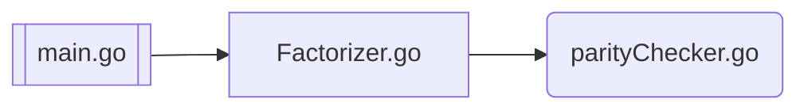
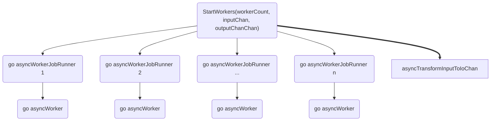

[](https://github.com/lintaba/kp-interview-go/actions/workflows/go.yml)
[](https://github.com/gomods/athens)
[](https://bitbucket.org/lbesson/ansi-colors)
[](https://https://docker.com/)


# Factorizer
This is a test / interview implementation, written in go. Author's kinda first go project. **Just move on.**

---


## Számok Faktorializálása

A faktorizálás egyszerre több magon zajlik, az eredmények sorrendben érkeznek vissza. A faktorizáló viselkedése több ponton is befolyásolható, pl teszteléshez.
A kiszámolandó számokat véletlenszerűen generáljuk, és az eredményeket alapértelmezés szerint kiírjuk az alábbi formátumban:
```bash
4.: 3! = 6, isOdd=false
```
A kiszámított érték esetenként kifejezetten nagy is lehet.

### Architektúra
A rendszer az alábbi komponensekből épül fel, melyet a main indít.



A faktorizálást párhuzamosan végzi cpuszám+1 gorutin. 

Inizializálás(`StartWorkers`) során létrehozza ezeket a rutinokat, melyek párhuzamosan várnak inputra, és párhuzamosan írják vissza az outputot. A workerek egymásról nem tudnak, egymásra nem várnak.
Az inicializátor további feladata, hogy a kapott feladatokat áttranszformálja egy olyan formátummá, ami utána sorrendtartóan olvasható, és ezt adja át a feldolgozó egységeknek.




Az `asyncWorkerJobRunner` dolga, hogy figyelje az új feldolgozandókat, elindítsa és leállítsa az asyncWorker-t, figyelje az eltelt időket, és az alapján timeoutolja a feldolgozást.

Az `asyncWorker` végzi a szükséges matematikai művelet elvégzését. (Esetünkben faktoriális számítást.) 
Érvénytelen bemenetre pánikol.
Futása megszakítható.
Az eredményt channelbe írja vissza.

Az `asyncTransformInputToIoChan` transzformálja a bemeneti folymatot egy olyan struktúrába, ami két elemet tartalmaz: az megoldandó feladatot, és egy, a megoldást váró channelt. A megoldást váró channelt elküldi a kimenet channelbe is,
így a bemenettel garantáltan azonos sorrendben jön létre egy kimeneti channelt tartalmazó channel. Az egyes al-elemekre így már lehet várni, és azok az eredmény elkészülte után lesznek olvashatóak.


Alapértelmezés szerint a konfigurációnak megfelelő bemenetet generál, és a generált sorrendben írja ki. 
A kiírást a `parityChecker`, C-ben írt paritás-ellenörzőn is átfuttatja, amivel kibővíti az eredmény-sort.


## Refs
- ref: https://gobyexample.com/worker-pools
- ref: https://gobyexample.com/testing-and-benchmarking
- ref: https://gobyexample.com/timeouts
- package: https://pkg.go.dev/math/big

